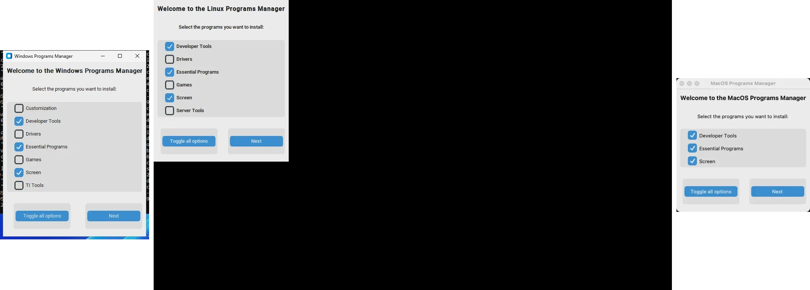

# Auto Installation Programs

Auto installation programs in a different operational systems

## Interface

## Packaging

The project is built with PyInstaller using `build.bat`. Only the `src` package
is bundled into the executable. Program lists (the `install/` JSON files) are
fetched at runtime directly from this GitHub repository, so **an internet
connection is required** when the application runs. This keeps the installer
small and always up-to-date with the latest program catalogue without needing
to rebuild.

The only local data written at runtime is:

- `user.json` — personal program additions saved next to the executable.
- `programs.log` — startup-key dump written by the Customization step.

## Installations

Installations in different Operational Systems

### [MacOS](MacOS.md)

### [Linux](Linux.md)

### [Windows](Windows.md)
