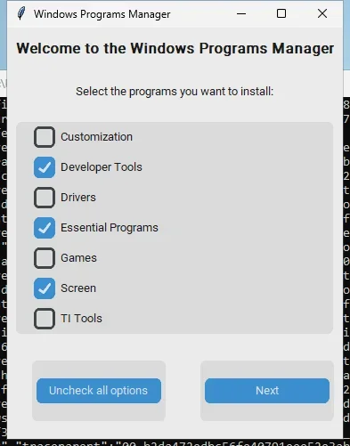

# Windows

This system install programs with basis in this topics:

- [Customization](#customization)
- [Developer Tools](#developer-tools)
- [Drivers](#drivers)
- [Essential Programs](#essential-programs)
- [Games](#games)
- [Microsoft Office](#microsoft-office)
- [Screen](#screen)

## Drivers

The system analyzes the video card and installs the necessary drivers.

- AMD
- Intel
- NVIDIA

## Essential Programs

Essential programs with basis in user settings

- Adobe Acrobat
- Cloudflare Warp
- Free Download Manager
- Google Chrome
- Google Drive
- Mozilla FireFox
- Spotify
- Telegram Desktop
- VLC
- WinRAR
- WhatsApp

## Microsoft Office

Office programs are selectable directly in the **Essentials** tab, under the "── Office ──" section.
The available programs are defined in [`install/windows/office.json`](install/windows/office.json).

For a custom Office deployment via the Office Deployment Tool, an official [`settings.xml`](install/windows/office/settings.xml) is included (LTSC 2024, PerpetualVL channel).
Consult [Deployment Settings](https://config.office.com/deploymentsettings) to generate a new `settings.xml`.

Default selectable programs:

- Microsoft 365 Apps
- Microsoft OneNote
- Microsoft Teams
- Notion
- Obsidian

## Screen

- AnyDesk
- SpaceDesk Client
- SpaceDesk Server

## Customization

- Lively Wallpaper
- Rainmeter
- TranslucentTB

## Developer Tools

- Arduino IDE
- Blender
- Docker Desktop
- Figma
- GIMP 3
- Git
- Github Desktop
- Java Runtime Environment
- Microsoft Teams
- MySQL Workbench
- Node.js
- Python 3.12
- Rufus
- Ventoy
- VirtualBox
- Visual Studio Code
- XAMPP

## Games

- CourseForge
- Discord
- Epic Games Launcher
- Google Play Games
- Radmin VPN
- Steam
- Xbox App
